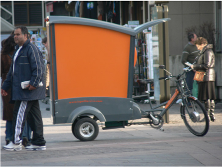
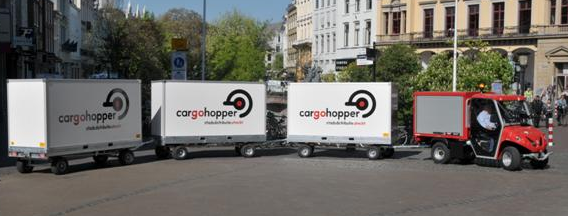
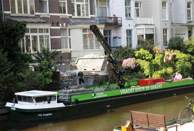
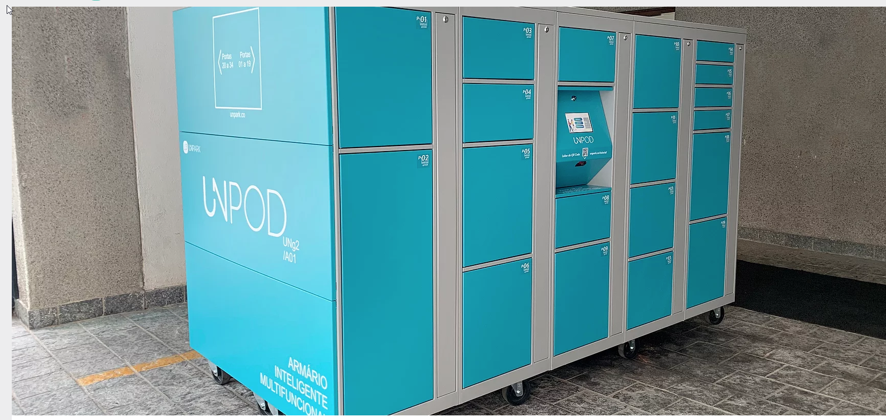
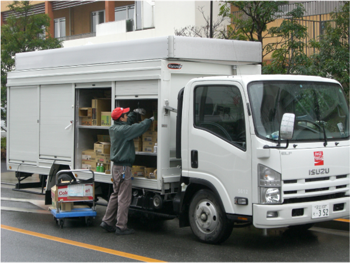

```{r child = "setup.Rmd"}
```

```{r xaringan-tile-view, echo=FALSE}
xaringanExtra::use_tile_view()
```

```{r xaringan-editable, echo=FALSE}
xaringanExtra::use_editable(expires = 1)
```

```{r xaringan-panelset, echo=FALSE, message=FALSE, warning=FALSE}
xaringanExtra::use_panelset()
xaringanExtra::style_panelset_tabs(panel_tab_font_family = "sans-serif")
```

```{r xaringanExtra-clipboard, echo=FALSE}
htmltools::tagList(
  xaringanExtra::use_clipboard(
    button_text = "<i class=\"fa fa-clipboard\"></i>",
    success_text = "<i class=\"fa fa-check\" style=\"color: #90BE6D\"></i>",
    error_text = "<i class=\"fa fa-times-circle\" style=\"color: #F94144\"></i>"
  ),
  rmarkdown::html_dependency_font_awesome()
)
```

```{r xaringan-fit-screen, echo=FALSE}
xaringanExtra::use_fit_screen()
```

```{r xaringan-extra-styles, echo=FALSE}
xaringanExtra::use_extra_styles(
  hover_code_line = TRUE,         #<<
  mute_unhighlighted_code = TRUE  #<<
)
```

```{css include=FALSE}
.panelset {
   --panel-tab-foreground: currentColor;
   --panel-tab-background: unset;
   --panel-tab-active-foreground: currentColor;
   --panel-tab-active-background: unset;
   --panel-tab-active-border-color: currentColor;
   --panel-tab-hover-foreground: currentColor;
   --panel-tab-hover-background: unset;
   --panel-tab-hover-border-color: currentColor;
   --panel-tab-inactive-opacity: 0.5;
   --panel-tabs-border-bottom: #ddd;
   --panel-tab-font-family: Sen;
   --panel-tab-background-color-active: #fffbe0;
   --panel-tab-border-color-active: #023d4d;
}

.panelset .panel-tabs .panel-tab > a {
	color: #023d4d;
}

.panelset .panel-tabs {
  font-size: 0.5rem;
}
```


class: center, middle

## Retrospecto

---

# Definições

## Logística

.midi[
.question[
“**Logística** é dispor a **mercadoria ou o serviço** certo, no **lugar** certo, no **tempo** certo e nas **condições desejadas**, ao mesmo tempo em que fornece a **maior contribuição à empresa**”. 
(Ballou, 2001)
]
]

### Gestão Cadeia de Suprimentos

.question[
.midi[
**Cadeia de suprimentos** é a estrutura consolidada e integrada, em níveis estratégico, tático e operacional, entre agentes de produção, mercadológicos, logísticos e sociedade, para que seja possível coordenar as operações de maneira a garantir a gestão orientada à logística, tendo como objetivo o _trade-off_ entre **responsividade** e **eficiência**, além de garantia de um contexto sustentável de desenvolvimento por ações **socialmente responsáveis** e **resilientes.** 
]
]

---

## Fatores-chave de desempenho

- Instalações   
- Estoques   
- Sourcing   
- Transportes   
- Informação   
- Pricing

---

class: center, middle

# Logística Urbana, Logística reversa, Logística Verde

---

# Cidades

## Definição 

+ A urbanização ocorre tanto pela mudança da população rural para núcleos urbanos como com o crescimento vegetativo da população urbana. 
+ Este processo teve início na primeira metade do século XIX.
+ Em 1800, apenas quatro por cento da população mundial vivia em cidades. 
+ Em 2000, esse número havia crescido para 50%. Hoje, há mais pessoas morando em cidades maiores (KAPLAN et al., 2004).
+ 54 % da população mundial vive em áreas urbanas (UN, 2014)
+ 2050 – 66% de população urbana

---

# Urbanização

```{r echo=FALSE, message=FALSE, warning=FALSE}

```


---

## Estrutura urbana global

+ As cidades pequenas são numerosas e muitas crescem rapidamente.
+ Globalmente, cerca de metade dos 3,9 bilhões de habitantes reside em pequenas cidades com até 500 mil habitantes, enquanto que apenas um em oito vive nas 28 megacidades com 10 milhões de habitantes ou mais. 
+ África e a Ásia são o lar de aproximadamente 90 por cento da população rural mundial. 
+ A Índia tem o maior número de população rural com 857 milhões, seguida da China com 635 milhões.

---
## Logística Urbana

```{r echo=FALSE, message=FALSE, warning=FALSE, out.width="90%"}

```
---

## Logística Urbana

```{r echo=FALSE, message=FALSE, warning=FALSE, out.width="75%"}

```

---

# Definições

É o processo de **otimização**, de **forma integrada**, das atividades relacionadas à logística que são realizadas em áreas urbanas. É abordada sob a ótica da **sustentabilidade**, com focos em atributos **econômicos, ambientais e sociais**. Este processo considera fatores como tráfego, congestionamento e consumo de energia. 


---

# Definições

O conceito de **City Logistics** pressupõe a transferência de cargas para **veículos menores** com operação urbana integrada por destino e **uso intensivo da tecnologia** tanto veicular quanto nos terminais, visando a informações em tempo real para roteirização dinâmica, rastreamento e agilização tanto da carga e descarga como dos fluxos de informações e documentos. Todos estes esforços são voltados para resolver o problema de percorrer as últimas distâncias com baixos custos, pois é nesta fase final das operações que os custos logísticos crescem exponencialmente. É o chamado, no exterior, problema da **última milha** (last mile problem).

---

# Definições

A **última milha** representa, em média, **28% do custo total de transporte** e representa aproximadamente **30% do volume de tráfego** nas grandes cidades. É responsável também por **20% a 35% das emissões de gases de efeito estufa**, além de representar entre **15% e 20% dos acidentes** gerados nas redes viárias urbanas. Portanto, a última milha se configura como o grande **desafio** das organizações no que tange a otimização da gestão da cadeia de suprimentos.

---

# Importância da carga urbana

+ Importância no modo de vida da população
+ Manutenção e conservação das atividades industriais e comerciais
+ Contribui para a competitividade industrial
+ Acarreta efeitos nos custos dos produtos consumidos pela população
+ Impacta o meio ambiente (consumo de energia, poluição, ruído, intrusão visual, 

.center[
.large[
Busca de equilíbrio entre a regulamentação pública, os interesses privados e as necessidades da sociedade
]
]

---

## Logística Urbana e uso do solo

```{r echo=FALSE, message=FALSE, warning=FALSE, out.width="75%"}

``` 

---

## Stakeholders

```{r echo=FALSE, message=FALSE, warning=FALSE, out.width="70%"}

``` 

---


### Desafios urbanos na movimentação de mercadorias

```{r echo=FALSE, message=FALSE, warning=FALSE, out.width="90%"}

``` 

---

### Fluxos Logísticos na cidade

```{r echo=FALSE, message=FALSE, warning=FALSE, out.width="80%"}

``` 

---

## Desafios atuais

+ Aumento do número de veículos de diferentes tipos
+ Congestionamentos 
+ Aumento dos custos logísticos (last mile representa 40% dos custos totais de transporte)
+ Aumento da poluição (21% das emissões de CO2)
+ Aumento dos processos produtivos baseados em um sistema just in time
+ Crescimento significativo do comércio eletrônico, com elevados volumes de entregas em domicílio.
+ Disrupção pela digitalização e pela pandemia
+ Espraiamento logístico
+ Entregas instantâneas

.center[
.large[
**Queda na qualidade de vida das pessoas**
]
]

---

# Soluções exploradas

+ volumes menores, drones, armazéns móveis

```{r echo=FALSE, message=FALSE, warning=FALSE, out.width="50%"}
knitr::include_graphics("img/9.jpg")
``` 

---

# Soluções exploradas

+ volumes menores, drones, armazéns móveis

```{r echo=FALSE, message=FALSE, warning=FALSE, out.width="50%"}
knitr::include_graphics("img/10.jpg")
``` 

---

# Soluções exploradas

+ volumes menores, drones, armazéns móveis

```{r echo=FALSE, message=FALSE, warning=FALSE, out.width="80%"}
knitr::include_graphics("img/12.jpg")
``` 

---

<iframe width="1068" height="601" src="https://www.youtube.com/embed/wrcC-_hRtYo" title="YouTube video player" frameborder="0" allow="accelerometer; autoplay; clipboard-write; encrypted-media; gyroscope; picture-in-picture" allowfullscreen></iframe>

---

# Soluções exploradas

+ volumes menores, drones, armazéns móveis

```{r echo=FALSE, message=FALSE, warning=FALSE, out.width="50%"}

``` 

---

# Soluções exploradas

+ volumes menores, drones, armazéns móveis

```{r echo=FALSE, message=FALSE, warning=FALSE, out.width="50%"}
knitr::include_graphics("img/25.jpg")
``` 

---

# Soluções exploradas

+ volumes menores, drones, armazéns móveis

```{r echo=FALSE, message=FALSE, warning=FALSE, out.width="50%"}

``` 

---

# Soluções exploradas

+ volumes menores, drones, armazéns móveis

```{r echo=FALSE, message=FALSE, warning=FALSE, out.width="60%"}

``` 

---

# Soluções exploradas

+ volumes menores, drones, armazéns móveis

```{r echo=FALSE, message=FALSE, warning=FALSE, out.width="60%"}

``` 

---

# Soluções exploradas

+ volumes menores, drones, armazéns móveis

```{r echo=FALSE, message=FALSE, warning=FALSE, out.width="60%"}
knitr::include_graphics("img/13.jpg")
``` 

---

# Soluções exploradas

+ volumes menores, drones, armazéns móveis

```{r echo=FALSE, message=FALSE, warning=FALSE, out.width="60%"}
knitr::include_graphics("img/14.jpg")
``` 

---

# Soluções exploradas

+ volumes menores, drones, armazéns móveis

```{r echo=FALSE, message=FALSE, warning=FALSE, out.width="60%"}

``` 

---

# Soluções exploradas

+ volumes menores, drones, armazéns móveis

```{r echo=FALSE, message=FALSE, warning=FALSE, out.width="60%"}

``` 

---

# Soluções exploradas

+ volumes menores, drones, armazéns móveis

```{r echo=FALSE, message=FALSE, warning=FALSE, out.width="60%"}

``` 

---

# Soluções exploradas

+ volumes menores, drones, armazéns móveis

```{r echo=FALSE, message=FALSE, warning=FALSE, out.width="60%"}
knitr::include_graphics("img/18.jpg")
``` 


---

# Soluções exploradas

+ volumes menores, drones, armazéns móveis

```{r echo=FALSE, message=FALSE, warning=FALSE, out.width="80%"}
knitr::include_graphics("img/19.jpg")
``` 


---

# Soluções exploradas

+ volumes menores, drones, armazéns móveis

```{r echo=FALSE, message=FALSE, warning=FALSE, out.width="60%"}
knitr::include_graphics("img/20.jpg")
``` 


---

# Soluções exploradas

+ Microhubs

```{r echo=FALSE, message=FALSE, warning=FALSE, out.width="80%"}
knitr::include_graphics("img/micro.png")
``` 

---

# Soluções exploradas

+ Operações de carga e descarga

```{r echo=FALSE, message=FALSE, warning=FALSE, out.width="80%"}

``` 

---

# Soluções exploradas

+ Muitos dados e pouca informação

[E-commerce mobilities observatory](https://www.ecommercemobilities.com/)

```{r echo=FALSE, message=FALSE, warning=FALSE, out.width="60%"}
knitr::include_graphics("img/big-tech.jpg")
``` 

---

# Soluções exploradas

+ Fiscalização x Gestão

```{r echo=FALSE, message=FALSE, warning=FALSE, out.width="80%"}

``` 

---

# Soluções exploradas

+ Pickup points

```{r echo=FALSE, message=FALSE, warning=FALSE, out.width="80%"}
knitr::include_graphics("img/4.jpg")
``` 

---


# Soluções exploradas

+ Pickup points

```{r echo=FALSE, message=FALSE, warning=FALSE, out.width="80%"}
knitr::include_graphics("img/pickup-points.jpeg")
``` 

---


# Soluções exploradas

+ Pickup points

```{r echo=FALSE, message=FALSE, warning=FALSE, out.width="80%"}

``` 


---

# Soluções exploradas

+ Entrega ativa

```{r echo=FALSE, message=FALSE, warning=FALSE, out.width="80%"}
knitr::include_graphics("img/shutterstock_159273458.jpg")
``` 


---

# Soluções exploradas

+ Entrega colaborativa e crowdshipping

```{r echo=FALSE, message=FALSE, warning=FALSE, out.width="60%"}

``` 


---

# Soluções exploradas

+ Produção e consumo locais

```{r echo=FALSE, message=FALSE, warning=FALSE, out.width="60%"}

``` 


---

<iframe width="1068" height="601" src="https://www.youtube.com/embed/HZF50kS2WyY" title="YouTube video player" frameborder="0" allow="accelerometer; autoplay; clipboard-write; encrypted-media; gyroscope; picture-in-picture" allowfullscreen></iframe>

---

# ALICE + Living LABS

<iframe width="1068" height="601" src="https://www.youtube.com/embed/K7QS1t1tRWM" title="YouTube video player" frameborder="0" allow="accelerometer; autoplay; clipboard-write; encrypted-media; gyroscope; picture-in-picture" allowfullscreen></iframe>


---

# Physical Internet

In logistics, the Physical Internet is an open global logistics system founded on physical, digital, and operational interconnectivity, through encapsulation, interfaces and protocols.[1] The Physical Internet is intended to replace current logistical models. The project currently has funding from the National Science Foundation as well as contributions from MHIA and CICMHE.

The Physical Internet Initiative's manifesto is "Transforming the way physical objects are handled, moved, stored, realized, supplied and used, aiming towards global logistics movments, shopping and sustainability."It attempts to achieve this by applying concepts from internet data transfer to real-world shipping processes.


---

# E-cargo bikes

<iframe width="1068" height="601" src="https://www.youtube.com/embed/TWg1qpFhENU" title="YouTube video player" frameborder="0" allow="accelerometer; autoplay; clipboard-write; encrypted-media; gyroscope; picture-in-picture" allowfullscreen></iframe>

---

<iframe width="1068" height="601" src="https://www.youtube.com/embed/oGgDelr8uls" title="YouTube video player" frameborder="0" allow="accelerometer; autoplay; clipboard-write; encrypted-media; gyroscope; picture-in-picture" allowfullscreen></iframe>

---

## Logística reversa, logística verde e logística sustentável

Indústria  |                                 Retornos (%)
-----------|---------------------------------------------
Revistas	|	                                   50
Livros - Editora	     |                 20 - 30
Livros - Distribuidora      |                10 - 20
Vendas por catálogo    |                  18 - 35
CD-ROMS          |                            18 - 25	
Computadores         |                       10 - 20
Impressoras           |                           4 - 8
Automotiva (partes)     |                      4 - 6

---

# Digital twins

```{r echo=FALSE, message=FALSE, warning=FALSE, out.width="50%"}
knitr::include_graphics("img/how-digital-twins-enable-intelligent-cities-img01.png")
``` 

.large[
.center[
**Cidades devem ser inteligentes ou humanas?**
]
]

---

# Reorganização das atividades

.small[
Pontos|	Entrega|	Atividade
------|--------|-----------
10| 10/02 | Estudos Autônomos 1 (entregue)
20|	20/02	| Projeto incremental 1 (entregue)
10| 16/03 | Estudos Autônomos 2 (entregue)
10| 23/03 | Estudos Autônomos 3 (entregue)
10| 30/03 | Estudos Autônomos 4 (entregue)
10| 07/04 | Estudos Autônomos 5 (entregue)
20|	14/04 |	Projeto incremental 2 (postado)
10| 14/04 | Engajamento
TOTAL:| |	100 pontos
]


---
.small[
Grupo 1: [Cadeia de suprimentos de medicamentos](https://www.youtube.com/watch?v=Tx3ERP33i_U)   
.small[Amanda Pimenta e Pedro Henrique Reis]

Grupo 2: [Digitalização do Setor automotivo](https://youtu.be/kolxomSVSrQ)   
.small[Ana Luiza Jorge, Amanda Harumy, Camila Correa, Flávia Sakai e Larissa Costa]

Grupo 3:  [Fluxo financeiro e digitalização](https://youtu.be/1BzRM178vyU)   
.small[Camila Pacífico, Maria Fernanda e Rafaela Cristina]

Grupo 4: [Economia da recorrência](https://www.youtube.com/watch?v=NZeoI-E3oJ4&feature=youtu.be)   
.small[Gabriel Gestaldi, Arthur, Gustavo Fontana e Lorena Rodrigues]

Grupo 5: [Varejo e digitalização - E-commerce](https://www.youtube.com/watch?v=kfa7IScuC4c&feature=youtu.be&ab_channel=HarleyViana)   
.small[Raphael Nicolete, Harley Viana, Helen Amorim e Larissa Freitas]

Grupo 6: [Aplicativo de entregas de bebidas](https://youtu.be/YwNbxe83Ejs)  
.small[Felipe Caxito, Lucas Teixeira, Matheus Troian, Renato Canuto e Patrícia Morozesk]

Grupo 7: [Uber]()   
.small[Leidiane Soares, Naiara Veloso, Mateus Mendes, Ana Paula, Vitor Vieira]
]
